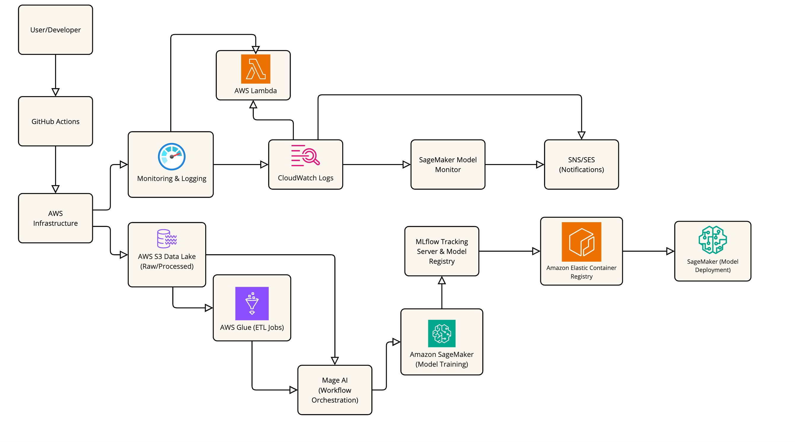

# Million Song MLOps Project

An end-to-end Machine Learning Operations (MLOps) project that uses the Million Song Dataset with AWS, Terraform, Docker, MLflow, and more!

## Description

### Objective

This project aims to build a comprehensive MLOps pipeline for the Million Song Dataset. We will develop a machine learning model to predict song popularity based on audio features and metadata. The pipeline will cover the entire ML lifecycle, including data preparation, model training, experiment tracking, model deployment, and monitoring.

### Dataset

We're using the [Million Song Dataset](http://millionsongdataset.com), specifically the [subset](http://millionsongdataset.com/pages/getting-dataset/#subset) of 10,000 songs. This dataset provides audio features and metadata for contemporary popular music tracks.

### Tools & Technologies

- Cloud Provider - [**Amazon Web Services (AWS)**](https://aws.amazon.com)
- Infrastructure as Code - [**Terraform**](https://www.terraform.io)
- Containerization - [**Docker**](https://www.docker.com), [**Docker Compose**](https://docs.docker.com/compose/)
- ML Framework - [**Scikit-learn**](https://scikit-learn.org/)
- Experiment Tracking and Model Registry - [**MLflow**](https://mlflow.org/)
- Workflow Orchestration - [**Mage AI**](https://www.mage.ai/)
- Model Deployment - [**AWS SageMaker**](https://aws.amazon.com/sagemaker/)
- Model Monitoring - [**Amazon CloudWatch**](https://aws.amazon.com/cloudwatch/)
- Data Storage - [**Amazon S3**](https://aws.amazon.com/s3/) (Data Lake), [**Amazon RDS**](https://aws.amazon.com/rds/) (Metadata)
- CI/CD - [**GitHub Actions**](https://github.com/features/actions)
- Language - [**Python**](https://www.python.org)

### Architecture




## Setup

**WARNING: You will be charged for the AWS resources created in this project. You can use the AWS Free Tier for some services, but not all.**

### Prerequisites

- AWS Account and configured AWS CLI
- Terraform installed
- Docker and Docker Compose installed
- Python 3.8+

### Getting Started

1. Clone the repository:
   ```
   git clone https://github.com/chrisdamba/million-song-mlops.git
   cd million-song-mlops
   ```

2. Set up the infrastructure with Terraform:
   ```
   cd terraform
   terraform init
   terraform apply
   ```

3. Set up the development environment:
   ```
   python -m venv venv
   source venv/bin/activate  # On Windows use `venv\Scripts\activate`
   pip install -r requirements.txt
   ```

4. Follow the setup instructions in the `setup/` directory for each component:
   - [Data Preparation](setup/data_prep.md)
   - [Model Training](setup/model_training.md)
   - [MLflow Setup](setup/mlflow.md)
   - [Mage AI Workflow](setup/mage_ai.md)
   - [Model Deployment](setup/deployment.md)
   - [Monitoring](setup/monitoring.md)

## Project Structure

```
million-song-mlops/
├── data/
├── models/
├── notebooks/
├── scripts/
│   ├── data_prep.py
│   ├── train_model.py
│   └── deploy_model.py
├── src/
│   ├── features/
│   ├── models/
│   └── utils/
├── tests/
├── setup/
│   ├── data_prep.md
│   ├── model_training.md
│   ├── mlflow.md
│   ├── mage_ai.md
│   ├── deployment.md
│   └── monitoring.md
├── terraform/
├── .github/workflows/
├── Dockerfile
├── docker-compose.yml
├── requirements.txt
├── README.md
└── .gitignore
```


## Usage

This section provides instructions on how to use the Million Song MLOps project, including running experiments, deploying models, and monitoring performance.

### Setting Up the Environment

1. Clone the repository:
   ```
   git clone https://github.com/chrisdamba/million-song-mlops.git
   cd million-song-mlops
   ```

2. Create and activate a virtual environment:
   ```
   python -m venv venv
   source venv/bin/activate  # On Windows use `venv\Scripts\activate`
   ```

3. Install the required packages:
   ```
   pip install -r requirements.txt
   ```

### Data Preparation

1. Navigate to the scripts directory:
   ```
   cd scripts
   ```

2. Run the data preparation script:
   ```
   python data_prep.py
   ```
   This script will download the Million Song Dataset subset, process it, and store the prepared data in your S3 bucket.

### Running Experiments

1. Start the MLflow tracking server:
   ```
   mlflow server --backend-store-uri sqlite:///mlflow.db --default-artifact-root ./mlflow-artifacts --host 0.0.0.0 --port 5000
   ```

2. In a new terminal, run the model training script:
   ```
   python train_model.py
   ```
   This script will train the model, log metrics and artifacts to MLflow.

3. View the MLflow UI by navigating to `http://localhost:5000` in your web browser.

### Deploying Models

1. Choose the best performing model from the MLflow UI.

2. Update the `model_uri` in the `deploy_model.py` script with the URI of your chosen model.

3. Run the deployment script:
   ```
   python deploy_model.py
   ```
   This will deploy your model to AWS SageMaker.

### Making Predictions

Once your model is deployed, you can make predictions using the AWS SageMaker Runtime:

```python
import boto3

client = boto3.client('sagemaker-runtime')

# Prepare your input data
input_data = {...}  # Your input data in the correct format

response = client.invoke_endpoint(
    EndpointName='your-endpoint-name',
    ContentType='application/json',
    Body=json.dumps(input_data)
)

result = json.loads(response['Body'].read().decode())
print(result)
```

### Monitoring Model Performance

1. Navigate to the AWS CloudWatch console.

2. Find the logs for your SageMaker endpoint.

3. Set up CloudWatch Alarms for metrics like model latency and error rates.

### Running the Full Pipeline

To run the entire pipeline from data preparation to model deployment:

1. Ensure you have set up the necessary AWS credentials and permissions.

2. Navigate to the project root directory.

3. Run the Mage AI workflow:
   ```
   mage run million_song_pipeline
   ```
   This will execute the entire pipeline, including data preparation, model training, and deployment.

### Continuous Integration/Continuous Deployment (CI/CD)

The project uses GitHub Actions for CI/CD. On every push to the main branch:

1. Tests are automatically run.
2. If tests pass, the model is retrained on the latest data.
3. If the new model performs better than the currently deployed model, it is automatically deployed to production.

You can view the status of these workflows in the "Actions" tab of the GitHub repository.


## Acknowledgements

- [Million Song Dataset](http://millionsongdataset.com) for providing the data
- [DataTalks.Club](https://datatalks.club) for inspiration and learning resources

```
